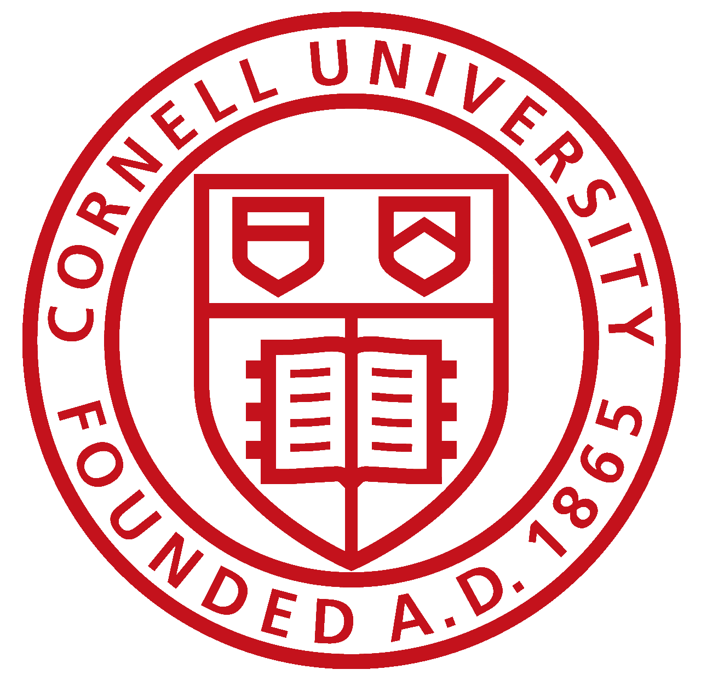

---
# Feel free to add content and custom Front Matter to this file.
# To modify the layout, see https://jekyllrb.com/docs/themes/#overriding-theme-defaults

layout: home
---

<!-- # [About](/) -->

# About

<table border="0">
 <tr>
    <td>
      Hi - my name is Kyle Coble.  
       
      I am an engineer focused in autonomous robotics, computer vision,
      and machine learning.
      I am completing my masters thesis at KTH Royal Institute of Technology
      where I am pursuing an MSc in Systems, Control, and Robotics
      in the Robotics and Autonomous Systems track.  
       
      Currently I am working as an intern at NASA Jet Propulsion Laboratory
      developing, simulating, and field testing solutions for autonomous drones
      built for search and rescue missions in challenging environments
      as part of <a href="https://costar.jpl.nasa.gov/">Team CoSTAR</a>.  
       
      <!-- Currently I am working as an intern at NASA Jet Propulsion Laboratory
      developing deep learning-based perception and localization technologies
      for fleets of autonomous maritime robots.   -->
      <!-- Currently I am working as an intern at NASA Jet Propulsion Laboratory
      working with deep learning-based perception and localization techniques
      for fleets of autonomous robots.  
       
      I am excited to begin my career developing autonomous robots
      that make our world cleaner, safer, and more accessible.  
       
      And be sure to check out [the documentation](https://alsarmie.github.io/DD2414-Documentation/)
      for the drone my friend Alex and I recently finished building from the ground up! -->
      <!-- I believe autonomous robots have the ability to make our world
      cleaner, safer, and more accessible and
      I am excited to begin my career developing autonomous robots for
      industries including **sustainability**, **space / ocean exploration**,
      and **mining / construction**. -->
    </td>
    <td>
      

        
      

    </td>
 </tr>
</table>

I am excited to begin my career developing autonomous robots
that make our world cleaner, safer, and more accessible.  
 
Be sure to check out [the documentation](https://alsarmie.github.io/DD2414-Documentation/)
for the drone my friend Alex and I recently finished building from the ground up!

<!-- 

  <kbd>
    
  </kbd>

Hi - my name is Kyle Coble.  
I am a robotics engineer focused in autonomous robotics and computer vision.  
I am in my final semester at KTH Royal Institute of Technology
where I am pursuing an MSc in Systems, Control, and Robotics.   -->

<!-- <td>
 -->
<!--  -->

# [Education](/education/)

<table border="0">
 <!-- <tr>
 </tr> -->
 <tr>
    <td>
      

        <!-- <a href="/education/"> -->
        
        <!-- </a> -->
      

    </td>
    <td>
      

        <!-- <a href="/education/"> -->
        
        <!-- </a> -->
      

    </td>
  </tr>
</table>

# [Experience](/experience/)

  <!-- <a href="/experience/"> -->
  
  <!-- </a> -->

 

  <!-- <a href="/experience/"> -->
  
  <!-- </a> -->

 

<table border="0">
 <tr>
    <td>
      

        <!-- <a href="/experience/"> -->
        
        <!-- </a> -->
      

    </td>
    <td>
      

        <!-- <a href="/experience/"> -->
        
        <!-- </a> -->
      

    </td>
  </tr>
</table>

# [Projects](/projects/)

  <!-- <a href="/projects/"> -->
  
  <!-- </a> -->

# [Publications](/publications/)

<table border="0">
 <tr>
    <td>
      <!-- <a href="/publications/"> -->
      
      <!-- </a> -->
    </td>
    <td>
      <!-- <a href="/publications/"> -->
      
      <!-- </a> -->
    </td>
    <td>
      <!-- <a href="/publications/"> -->
      
      <!-- </a> -->
    </td>
  </tr>
</table>

# [Skills](/skills/)

<table border="0">
  <tr>
    <td>

</td>
    <td>

</td>
    <td>

</td>
    <td>

</td>
  </tr>
  <tr>
    <td>

</td>
    <td>

</td>
    <td>

</td>
    <td>

</td>
  </tr>
</table>
