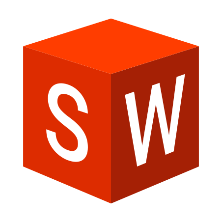

---
# Feel free to add content and custom Front Matter to this file.
# To modify the layout, see https://jekyllrb.com/docs/themes/#overriding-theme-defaults

layout: home
---

<!-- # [About](/) -->

# About

<table border="0">
 <tr>
    <td>
      Hi - my name is Kyle Coble.  
       
      I am passionate about developing autonomous robots
      that make our world cleaner, safer, and more accessible.
      I recognize that through thoughtful solutions, robotics can play a key role in making our world
      more liveable for *everyone* today and for future generations.
      I am a roboticist, a computer vision engineer,
      a firmware developer, a planner,
      and an open source community builder. 
       
    </td>
    <td>
      

        
      

    </td>
 </tr>
</table>

I have experience with robots across many environments,
including aerial drones, autonomous underwater vehicles, maritime robotics, planetary exploration rovers, and agricultural robots. 
 
My MSc thesis at KTH focused on the use of deep learning-based semantic segmentation
for terrain relative navigation of robots in extreme, GPS-denied environments,
including unmanned surface vessels (USVs) and planetary exploration rovers. 
 
Prior to joining farm-ng, I was at NASA Jet Propulsion Laboratory
developing, simulating, and field testing solutions for autonomous drones
built for search and rescue missions in challenging (underground!) environments
as part of <a href="https://costar.jpl.nasa.gov/">Team CoSTAR</a>. 
 
Be sure to check out the documentation for the [Amiga Software Development Kit](https://amiga.farm-ng.com/)
we've created at farm-ng or the ["Awesome Drone"](https://alsarmie.github.io/DD2414-Documentation/)
my friend Alex and I built from the ground up!

# [Education](/education/)

<table border="0">
 <!-- <tr>
 </tr> -->
 <tr>
    <td>
      

        <!-- <a href="/education/"> -->
        
        <!-- </a> -->
      

    </td>
    <td>
      

        <!-- <a href="/education/"> -->
        
        <!-- </a> -->
      

    </td>
  </tr>
</table>

# [Experience](/experience/)

  <!-- <a href="/experience/"> -->
  
  <!-- </a> -->

 

  <!-- <a href="/experience/"> -->
  
  <!-- </a> -->

 

  <!-- <a href="/experience/"> -->
  
  <!-- </a> -->

 

<table border="0">
 <tr>
    <td>
      

        <!-- <a href="/experience/"> -->
        
        <!-- </a> -->
      

    </td>
    <td>
      

        <!-- <a href="/experience/"> -->
        
        <!-- </a> -->
      

    </td>
  </tr>
</table>

# [Projects](/projects/)

  <!-- <a href="/projects/"> -->
  
  <!-- </a> -->

# [Publications](/publications/)

<table border="0">
 <tr>
    <td>
      <!-- <a href="/publications/"> -->
      
      <!-- </a> -->
    </td>
    <td>
      <!-- <a href="/publications/"> -->
      
      <!-- </a> -->
    </td>
    <td>
      <!-- <a href="/publications/"> -->
      
      <!-- </a> -->
    </td>
  </tr>
</table>

# [Skills](/skills/)

<table border="0">
  <tr>
    <td>

</td>
    <td>

</td>
    <td>

</td>
    <td>

</td>
  </tr>
  <tr>
    <td>

</td>
    <td>

</td>
    <td>

</td>
    <td>

</td>
  </tr>
</table>
